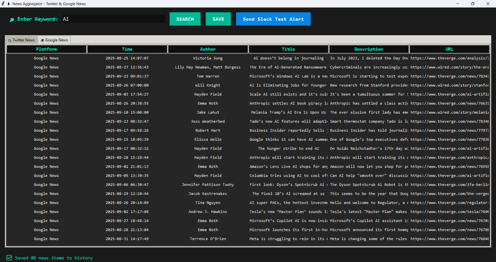
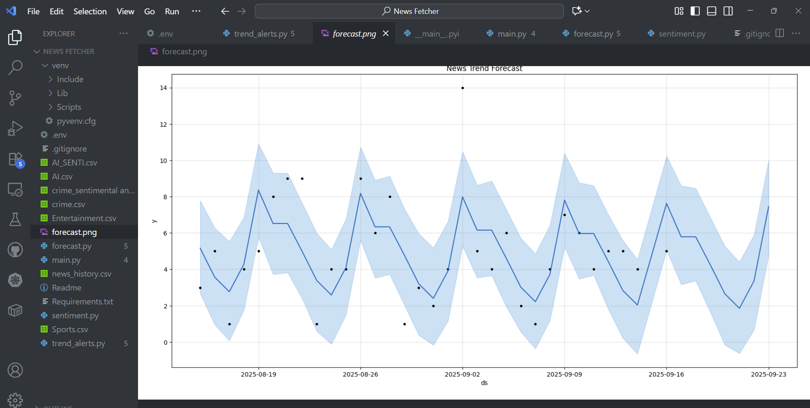

# ⚡ News Fetcher & Trend Alert System


A **real-time News Monitoring and Forecasting System** built with Python.
It fetches news from **Twitter** and **Google News**, applies **sentiment analysis**, saves results, builds **forecasting models**, and delivers **real-time alerts to Slack** when unusual spikes occur.

---

## ✨ Features

* 🐦 Fetch latest tweets via **Tweepy**
* 🌍 Aggregate news from **Google News API**
* 🔎 Keyword-based search in a Tkinter GUI
* ⭐ Sentiment scoring with emoji-based stars (1–5)
* 💾 Export results to CSV
* 📊 Historical data tracking for forecasting
* 📈 Time-series forecasting using **Facebook Prophet**
* 🔔 Automated Slack alerts for spikes or anomalies

---

## 🛠 Tech Stack

* **Frontend / GUI:** Tkinter
* **APIs:** Tweepy (Twitter), NewsAPI (Google News)
* **Data Handling:** Pandas, Regex
* **Forecasting:** Prophet, Plotly
* **Alerts:** Slack Incoming Webhooks
* **NLP (optional):** Gemini API / Transformers for sentiment

---

## 📂 Project Structure

```
News-Fetcher/
│── main.py            # Tkinter GUI app: fetch news & display results
│── trend_alerts.py    # Forecasting & Slack alert system
│── requirements.txt   # Dependencies
│── .env               # API keys & secrets (ignored in GitHub)
│── news_history.csv   # Saved historical news data
│── README.md          # Project documentation
```

---

## ⚙️ Setup Instructions

### 1️⃣ Clone the Repository

```bash
git clone https://github.com/YOUR-USERNAME/News-Fetcher.git
cd News-Fetcher
```

### 2️⃣ Create Virtual Environment

```bash
python -m venv venv
```

Activate it:

* Windows (PowerShell):

  ```powershell
  venv\Scripts\activate
  ```
* Mac/Linux:

  ```bash
  source venv/bin/activate
  ```

### 3️⃣ Install Dependencies

```bash
pip install -r requirements.txt
```

### 4️⃣ Configure Environment

Create a `.env` file in the root:

```ini
# Twitter API
TWITTER_BEARER_TOKEN=your_twitter_bearer_token

# Google News API
NEWSAPI_KEY=your_newsapi_key

# Gemini API (optional sentiment)
GEMINI_API_KEY=your_gemini_api_key

# Slack Webhook
SLACK_WEBHOOK_URL=https://hooks.slack.com/services/XXXXX/XXXXX/XXXXX
```

---

## ▶️ Usage

### Run News Aggregator GUI

```bash
python main.py
```

🔹 Lets you search, view, and save latest news.

### Run Forecasting & Alerts

```bash
python trend_alerts.py
```

🔹 Builds forecasts on saved history & sends Slack alerts.

---

| News Aggregator      | Forecasting Alert              |
| -------------------- | ------------------------------ |
|  |  |

---

## 🔔 Example Slack Alert

```
🚨 Spike detected! Latest=120, Avg=75.3
```

---

## 📜 Future Improvements

* ✅ Advanced sentiment with HuggingFace Transformers
* ✅ Dashboard with Streamlit for interactive trends
* ✅ Database storage (PostgreSQL / MongoDB) instead of CSV
* ✅ Multi-language support

---

## 🧑‍💻 Authors

* **Akankshya Panda** – Developer & Researcher

---

## 📜 License

This project is licensed under the MIT License.

